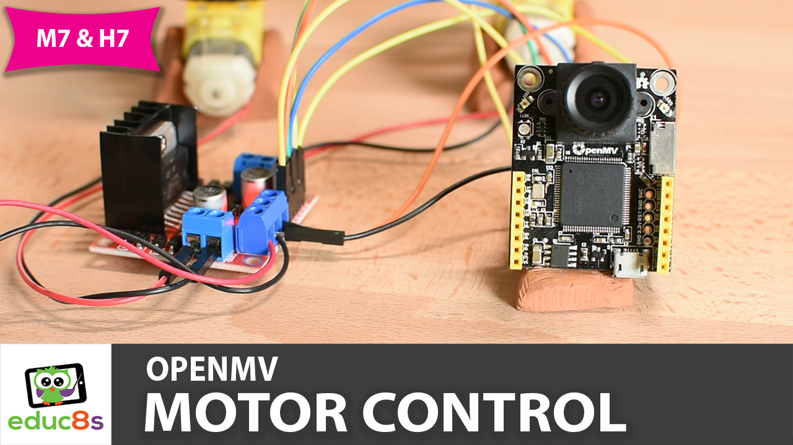

# OpenMV-L298N-Motor-Control

This is an Automatic RGB565 Color Tracking Example project that comes with the OpenMV cam. It lets you track an object by color. I modified the provided code to support the inexpensive (less than $10) ILI9341 display. Using an OpenMV H7 cam it can track an object and drive the display at 40 fps! Check the video for more details.

  

🎥 <a href="https://www.youtube.com/watch?v=N6xXUvtEGF0">Video Tutorial on YouTube</a>

 
 

| 📺 <a href="https://www.youtube.com/educ8s">YouTube</a>
| 🌍 <a href="http://www.educ8s.tv">Website</a> |  

# Parts Needed

🛒 OpenMV M7 ▶ http://educ8s.tv/part/OpenMV

🛒 OpenMV H7 ▶ http://educ8s.tv/part/OpenMVH7  💡 FASTER

🛒 L298N Driver ▶ http://educ8s.tv/part/L298N

🛒 2 DC Motors ▶ http://educ8s.tv/part/DCmotors

🛒 Battery Holder ▶ http://educ8s.tv/part/5AAHolder

🛒 Wires ▶ http://educ8s.tv/part/JumperWires

💖 Full disclosure: All of the links above are affiliate links. I get a small percentage of each sale they generate. Thank you for your support!

# Schematic

